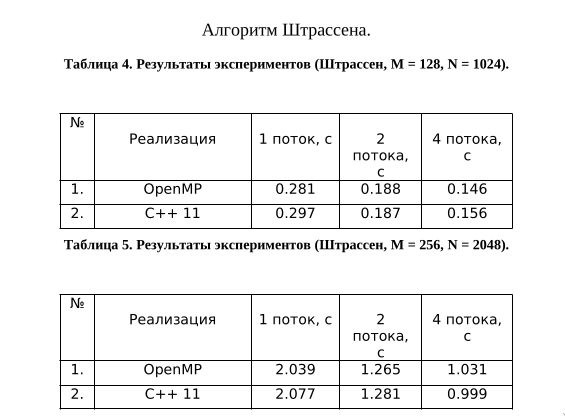

# Реализация алгоритма Штрассена с использованием OpenMP и с использованием пула потоков C++ 11

## Задача

Используя технологию OpenMP, реализовать параллельный алгоритм Штрассена умножения плотных матриц. Затем повторить реализацию параллельных
алгоритмов с использованием средств многопоточности в стандарте C++ 11. Требуется написать программы, решающие поставленные задачи. В программах необходимо реализовать параллельный алгоритм решения задачи сначала с использованием OpenMP, а затем используя библиотеку потоков C++ 11. Также требуется провести эксперименты и сравнить время работы разных реализаций на одном и нескольких потоках.

## Результаты

